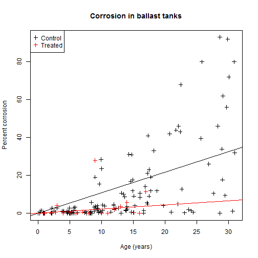
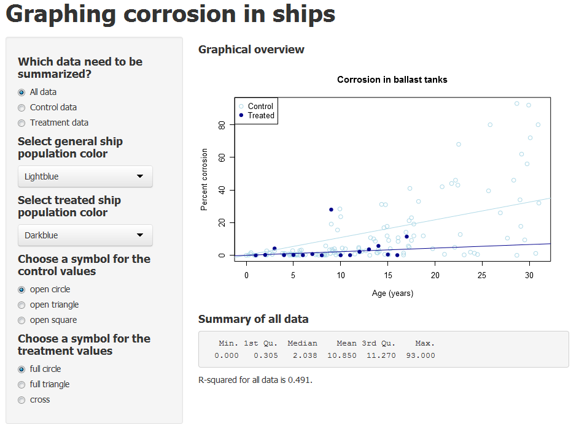

## The classic approach is dull

Here are the data on a simple R plot. 
Which is indeed rather boring to look at, admittedly...

 

---

## The solution ?

- Create an interactive plot where the colors can be adapted to suit the needs of the presenter.
- Widgets control color, style and a light descriptive statistic analysis of the data. 
- This app serves as a basic model for the creation of more in-depth analysis tools, offering the presenter the full range of analysis choices for an interactive lecture. 
- Future enhancements should offer the option to investigate many parameters (instead of just the one 'treatment' mentioned here).

---

